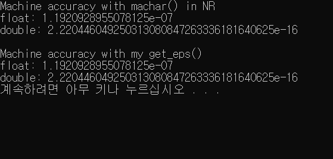
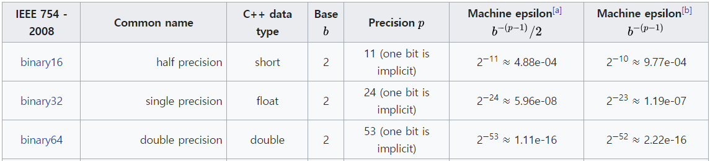

# Numerical Analysis Homework #1


## 1. 이론

### Machine accuracy (Machine epsilon)

1.0과 더했을 때, 결과가 1.0이 나오지 않는 가장 작은 부동소수점 숫자 $\epsilon$를 machine accuracy로 정의한다.

​	$$ \epsilon = b^{1-m} $$ (m = number of bits for mantissa) $$


## 2. 구현

구현 환경: **C++**

### Method 1: machar() in NR in C

NR in C 라이브러리에 포함된 `machar()` 함수는 기본적으로 float 타입의 포맷 정보를 함수 매개변수에 기록한다. 이 float을 템플릿 제네릭 타입 T로 수정하여, 다른 타입들의 정보도 얻어올 수 있도록 했다. 그렇게 얻은 machine accuracy를 `eps` 변수에 저장하고, 이 값을 반환하는 `get_eps_NR<typename>` 함수를 구현했다.

### Method 2: get_eps() 직접 구현

1. $ 1+2^{-n}=1$을 만족하는 n을 반복문을 통해서 찾는다.
2. base number 2를 -n제곱하여 나온 결과를 반환한다.

```c++
template <typename T>
T get_eps() {
  int n;
  T base = static_cast<T>(2);
  int bits_num = sizeof(T) * 8;
  for (n = 0; n < bits_num; ++n) {
    if (1 + pow(base, -n) == 1) {
      n--;
      break;
    }
  }
  return pow(base, -n);
}
```


## 3. 결과 (next page)





(Table reference: Wikipedia)