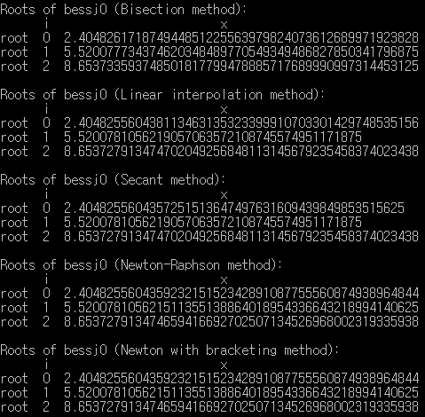
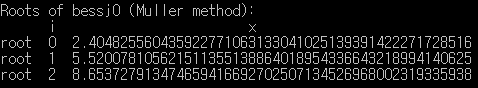
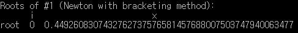
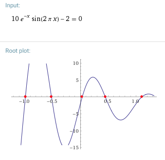
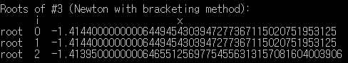
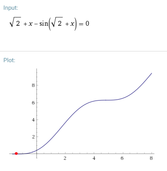
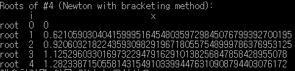
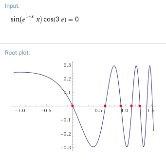

# Numerical Analysis Homework #2

## 0. 실행 방법

* ***Numerical Recipes in C* library is required. (not included here!)**
* Visual Studio 2017 환경에서 **C++**로 작성됐다.
* `/NRs` 디렉토리에 포함된 C++용 헤더 파일 및 소스 파일과 함께 컴파일해야 한다. 
* NR in C 라이브러리를 제외하고 두 개의 소스 코드 파일로 구성되어 있다.
  * `root_finding.cpp` (NR in C를 이용한 Bessel function의 풀이 및 방정식 풀이)
  * `muller.cpp` (Muller method 구현)

## 1. Find roots of the Bessel function (by NR in C)

소스 코드는 `root_finding.cpp`에 포함되어 있다.

* interval = [1.0, 10.0]

* N = 10000
* xacc = 1.0E-6

## 2. Write source codes for Muller method

소스 코드는 `muller.cpp`에 포함되어 있다.

- interval = [1.0, 10.0]
- N = 10000
- xacc = 1.0E-6
- 몇 번의 이터레이션을 넘으면 기계 오차로 인하여 일부 변수에서 NaN(나누기 0)이 발생했다. 문제를 해결하기 위해, C 표준 라이브러리의 `isnan()` 함수를 이용해서 NaN의 발생을 체크하고, NaN이 발생하면 이터레이션을 중단하도록 했다.

## 3. Convergence speed of the methods

수렴 속도를 확인하기 위해서 하나의 근(x0)을 계산할 때, 이터레이션 카운트(각 루틴 내부에서 루프가 돌아가는 횟수)를 측정했다. 결과는 다음과 같다.

|                        | Iterations at N=25 |
| ---------------------- | ------------------ |
| Bisection              | 18                 |
| Linear interpolation   | 5                  |
| Secant                 | 4                  |
| Newton-Raphson         | 4                  |
| Newton with bracketing | 4                  |
| Muller                 | 7                  |

위 다섯 개의 메소드의 수렴 속도는 대체로 이론과 일치했으나, 일반적으로 Secant method(order of convergence≒1.62)보다 수렴 속도가 조금 더 빠른 Muller's method(order of convergence≒1.84)가 예상보다 느리게 나왔다. 함수의 모양 등 여러 요인에 영향을 받을 수 있다. 

## 4. Problems

먼저 WolframAlpha를 이용하여 주어진 식 f(x)의 도함수 f'(x)를 구하고, rtsafe() 함수를 이용해서 근을 얻었다. 이렇게 얻은 근은 WolframAlpha가 계산한 근과 비교했다. 소스 코드는 `root_finding.cpp`에 포함되어 있다.

#### 주어진 식 1

* f(x) = 10 * e^(-x) * sin(2 * pi * x) - 2 = 0
* f'(x) = 10 * e^(-x) (2 π cos(2 π x) - sin(2 π x))
* interval = [0.1, 1.0]

* WolframAlpha가 계산한 [0.1, 1.0]에서의 근 0.449261과 일치한다.

#### 주어진 식 2

* f(x) = x^2 - 2 * x * (e^(-x)) + e^(-2 * x) = 0
* f'(x) = 2 * e^(-2 * x) * (1 + e^x) * (e^x * x - 1)
* interval = [0.0, 1.0]

* 위 그래프에서 보듯 실제로는 범위 내에서 중근이 존재하는 비선형 방정식이지만, rtsafe() 등 뉴튼 메소드를 통해서 근을 계산할 수 없었다. 

#### 주어진 식 3

* f(x) = sqrt(2) + x - sin(sqrt(2) + x) = 0

* f'(x) = cos(x + sqrt(2)) + x * (x / 2 + sqrt(2))
* interval = [-2.0, -1.0]

* 실제로는 범위 내에서 하나의 근이 존재하지만, 프로그램에서는 발산하여 여러 개의 근이 존재하는 것처럼 출력됐다.
* WolframAlpha가 계산한 근 -1.4087604와 가깝지만 정확한 값으로 수렴하지는 못했음을 알 수 있다.

#### 임의의 흥미로운 식

* f(x) = sin(e^(1+x) * x) * cos(3 * e) = 0
* f'(x) = e^(1 + x) (1 + x) cos(3 e) cos(e^(1 + x) x)
* interval = [0.0, 1.4]

* WolframAlpha가 계산한 근 0, 0.621059, 0.920603, 1.1252960, 1.2823387과 일치한다.